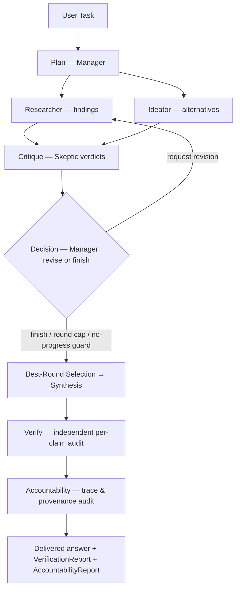
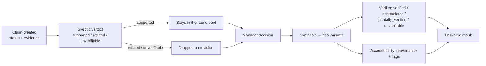

# AI Nexus

**Six agents. One verified answer.**

AI Nexus is a **local-first multi-agent reasoning system** that orchestrates specialized AI agents to research, challenge, refine, synthesize, and independently verify complex tasks — entirely on your machine.

Every run produces more than an answer: you get an **auditable chain of reasoning** — structured claims with cited evidence, skeptic verdicts on every claim, explicit routing decisions, and two mandatory audit layers that run before anything is delivered.

**Python / FastAPI • Ollama • Qwen • React / TypeScript • Vite • SQLite • SSE**

---

## Contents

- [The Idea](#the-idea)
- [Why AI Nexus Is Different](#why-ai-nexus-is-different)
- [Agent Architecture](#agent-architecture)
- [How a Run Works](#how-a-run-works)
- [The Claim & Evidence Model](#the-claim--evidence-model)
- [Product Features](#product-features)
- [The Live UI](#the-live-ui)
- [Technical Architecture](#technical-architecture)
- [Tech Stack](#tech-stack)
- [Testing & Engineering Quality](#testing--engineering-quality)
- [Evaluation](#evaluation)
- [Built for Local-First](#built-for-local-first)
- [Getting Started](#getting-started)
- [Project Structure](#project-structure)
- [Design Philosophy](#design-philosophy)
- [Design Considerations](#design-considerations)
- [Roadmap](#roadmap)

---

## The Idea

Most LLM applications rely on one generation pass: prompt in, paragraph out. Facts, assumptions, and guesses arrive flattened together, with nothing that re-examines the finished answer before it reaches you.

**AI Nexus treats reasoning as a workflow.**

Instead of a single response, a task moves through deliberate stages — research, ideation, skepticism, decision-making, synthesis, verification, accountability — each owned by a specialized agent with its own role, tool set, and output contract. The system doesn't just generate text; it builds a structured argument, challenges it, routes revisions, and audits the result before delivery.

The architecture is intentional on two fronts:

- **Agents exchange structured artifacts only** — claims, verdicts, decisions, reports — never free-form peer prose. Everything that matters is machine-checkable.
- **The process itself is reviewable** — every step, claim, verdict, and audit is persisted, streamed live to the UI, and replayable after a restart.

---

## Why AI Nexus Is Different

### 🧠 Multi-Agent Reasoning
Six specialized agents approach every task from different angles — investigation, creativity, criticism, control, verification, and accountability — instead of one model playing all parts in a single monologue.

### 🧾 Structured Epistemology
Claims explicitly declare what they *are*: a fact, an assumption, a hypothesis, an opinion, an inference, or unverified. Uncertainty is a first-class citizen, not a hedging phrase.

### 📎 Evidence-First Reasoning
Claims carry source citations and optional quotations. A `supported` verdict without evidence is rejected **by code** — unsupported confidence cannot pass review.

### ✅ Independent Verification
The finished answer passes through a dedicated verification stage that re-checks each final claim with its own tool calls, producing a per-claim verdict independent of the workers that wrote it.

### 🛡️ Accountability Layer
A separate agent audits the execution trace, provenance, and completeness of the entire run — with mechanical facts merged in by code so the report can never under-report.

### 🎛️ Bounded Orchestration
Explicit routing, round caps, tool limits, and deterministic stop conditions. No unbounded agent loops — by construction.

### 🖥️ Local-First
Inference runs through **Ollama** on your own hardware. No paid cloud inference API, no external database, no vendor lock-in.

---

## Agent Architecture

Six agents, three tiers of responsibility — a control plane, two workers, and two auditors.

| Agent | Role | What it contributes |
|---|---|---|
| **Manager** | The control plane. Plans the workflow, evaluates progress, and routes revisions through explicit JSON decisions executed by Python. | Routing decisions, final synthesis |
| **Researcher** | The investigator. Gathers evidence through the configured tool set before answering — files, memory, and optional live web search. | Finding claims with cited evidence |
| **Ideator** | The explorer. Generates alternatives, hypotheses, and solution paths the task might otherwise never reach. | Idea claims with cited evidence |
| **Skeptic** | The critic. Issues a verdict on every claim each round — supported, refuted, or unverifiable — with a mandatory objection and its own evidence. | Per-claim verdicts |
| **Verifier** | The independent auditor. Re-checks every claim in the final answer using its own tool calls, producing a four-valued verification report. | `VerificationReport` |
| **Accountability** | The process auditor. Reviews the run's trace and provenance, raising flags across ten categories with graded severity. | `AccountabilityReport` |

Design rules that make this architecture hold:

- **No prose crossing between workers.** Agents never see each other's prose or memory — enforced by tests. The only prose that crosses a boundary is the final answer, seen by the two auditors (their job is to audit exactly that).
- **The Manager routes, it doesn't opine.** Its decisions are schema-constrained JSON executed by code; it sees only a bounded registry summary, never worker prose.
- **Both audits are mandatory.** Every completed run carries a verification report and an accountability report — there is no unaudited delivery path.

---

## How a Run Works

`app/orchestrator.py` is the single orchestrator — one deterministic loop:



**Stage by stage:**

1. **Plan** — the Manager frames the task and dispatches the first round.
2. **Research ∥ Ideate** — both workers run in parallel, producing claims with evidence through their bounded tool loops.
3. **Critique** — the Skeptic verdicts every claim in the pool, with objections and evidence.
4. **Decide** — the Manager routes a revision or finishes. Guarded by deterministic stop conditions: round cap, repeated-decision, no-progress, and step caps all produce visible finish decisions.
5. **Best-Round Selection → Synthesis** — the strongest round (supported minus unresolved claims) becomes the final answer.
6. **Verify** — the Verifier audits the final answer claim by claim with independent tool checks.
7. **Accountability** — the process audit validates trace completeness and provenance.
8. **Deliver** — answer plus both audit reports, streamed live and persisted.

Agents exchange **structured artifacts, not unrestricted peer-to-peer chatter** — every hand-off is a typed, validated object.

---

## The Claim & Evidence Model

The heart of the system: a typed claim lifecycle instead of fluent prose.



**The vocabularies (all Pydantic-validated, frozen at use sites):**

| Layer | Values |
|---|---|
| **Claim status** (6) | `fact` · `assumption` · `hypothesis` · `opinion` · `inference` · `unverified` |
| **Skeptic verdict** (3) | `supported` · `refuted` · `unverifiable` |
| **Verification status** (4) | `verified` · `contradicted` · `partially_verified` · `unverifiable` |
| **Accountability flags** (10 kinds × 3 severities) | trace completeness, unsupported final claims, provenance gaps, decision inconsistency, tool-use inconsistency, premature stop, and more — graded `info` / `warning` / `violation` |

**Why it matters:**

- **Nothing is "just prose."** Every assertion carries its epistemic status and its sources.
- **Verification is genuinely independent.** A prior `supported` verdict is context for the Verifier — never grounds for `verified`.
- **Uncertainty is preserved.** Unverifiable claims stay labeled as unverifiable all the way to the final report.
- **The pipeline is enforceable.** Claim identifiers are assigned by code, blank fields are rejected, and schema-invalid output never reaches the pool.

---

## Product Features

**Reasoning core**
- 🔄 Multi-agent orchestration with iterative critique/revision rounds
- 🧮 Best-round selection — synthesis draws from the strongest round, not the last one
- 🧾 Evidence-aware claims with citations and optional quotations
- ✅ Independent verification with per-claim, four-valued outcomes
- 🛡️ Accountability auditing of trace, provenance, and completeness
- 🎯 Deterministic stop conditions — round caps, no-progress guards, step caps
- 🧬 Structured JSON-schema outputs enforced through grammar-constrained generation
- 🛠️ Bounded tool loops with repeat/step/budget guards

**Tools & research**
- 📂 Sandboxed file search & file reader (confined to a configured root)
- 🧠 Namespaced agent memory, isolated per run and per agent
- 🌐 Optional live web research — paced DDG→Bing cascade, cached, off by default

**Platform**
- 🖥️ Local Ollama inference — no cloud API required
- ⚡ Real-time SSE execution feed (5 event types)
- 💾 SQLite persistence with WAL and event-projection writes
- 📚 Full run history with retention management
- 🔁 Restart-safe replay — events and run detail served from disk after a restart
- 🩺 Health endpoint with provider/model reachability and effective configuration
- 🖥️ CLI execution for the full pipeline, agents, or a single round-trip
- 📊 Evaluation harness with controlled problems, mandatory/advisory checks, and a human-scored rubric

---

## The Live UI

The React frontend is a **real operations console**, not a chat box.

- **Live task submission** — start a run and watch it unfold step by step
- **Execution feed** — every stage (`plan` → `research` → `ideate` → `critique` → `decide` → `revise` → `synthesize` → `verify` → `audit`) appears as it happens
- **Round panels** — claims, verdicts, and decisions joined with their evidence
- **Verification panel** — the Verifier's per-claim report on the final answer
- **Accountability panel** — trace and provenance audit with graded flags
- **Final result** — the answer alongside both audit reports
- **Run history** — every past run, persisted and replayable

> **You don't just receive an answer — you can watch how the system arrived there.**

The UI is a pure event reducer over the SSE stream: it folds events into a view model and never sequences work itself. Network boundaries are test-enforced, and the wire format is guarded by a backend contract test.

---

## Technical Architecture

```
┌─────────────────────────────────────────────────────────────┐
│  React 19 + TypeScript (Vite) — pure event reducer          │
│  TaskForm · RunFeed · RoundPanel · VerificationPanel ·       │
│  AccountabilityPanel · FinalResult · RunHistory              │
└────────────────────────┬────────────────────────────────────┘
                         │ REST + SSE (5 event types)
┌────────────────────────▼────────────────────────────────────┐
│  FastAPI — runs, health, SSE replay                          │
├─────────────────────────────────────────────────────────────┤
│  Orchestrator (the only loop)                                │
│  plan → research ∥ ideate → critique → decide → (revise)*    │
│  → synthesize → verify → audit                               │
├──────────────┬───────────────┬──────────────────────────────┤
│ 6 agent      │ Claim/verdict │ Audits                       │
│ modules +    │ validation    │ verification rules +         │
│ tool loops   │ (Pydantic)    │ accountability enforcement   │
├──────────────┴───────────────┴──────────────────────────────┤
│  Tool registry: file_search · file_reader · memory ·         │
│  web_search (optional, paced cascade)                        │
├─────────────────────────────────────────────────────────────┤
│  RunStore — SQLite (WAL), event projection, replay           │
├─────────────────────────────────────────────────────────────┤
│  Ollama — qwen2.5:14b-instruct (grammar-constrained output)  │
└─────────────────────────────────────────────────────────────┘
```

**Boundaries that matter:**

| Concern | Where it lives |
|---|---|
| LLM HTTP | `backend/app/llm/` only |
| Orchestration | `backend/app/orchestrator.py` — the single loop |
| Validation | Pydantic models + Ollama `format=` grammar with targeted retry |
| Persistence | `RunStore` — SQLite WAL behind one `append_event` funnel |
| Transport | REST + SSE, wire types contract-tested across the stack |
| HTTP client layer | `httpx` confined to the model layer and search providers |
| Frontend state | Pure reducer — no side-effectful sequencing |

---

## Tech Stack

| Layer | Technology | Purpose |
|---|---|---|
| Backend | **Python ≥ 3.12** · FastAPI · uvicorn | API, SSE streaming, orchestration |
| Validation | **Pydantic 2.13** + pydantic-settings | Typed domain models, config, contract enforcement |
| Model layer | **Ollama** — `qwen2.5:14b-instruct` (fallback `7b`) | Local inference, grammar-constrained structured output |
| Storage | **SQLite** (stdlib, WAL, no ORM) | Runs, events, replay, retention |
| Frontend | **React 19** · TypeScript · **Vite** | Live operations console |
| Testing | **pytest** · **Vitest** · Testing Library | Offline + integration suites |
| Transport | **REST + SSE** | Command API + real-time execution feed |
| Search | DDG→Bing cascade (opt-in) | Optional live web research |
| Cloud services | **None required** | No paid API, no external DB |

---

## Testing & Engineering Quality

AI Nexus is engineered like infrastructure — with tests to match.

```bash
# Backend — offline suite (no model, no network): 564 tests, ~2 s
cd backend && .venv/bin/python -m pytest -q

# Backend — live integration suite: 15 tests (auto-skips if Ollama is down)
cd backend && .venv/bin/python -m pytest -q -m integration

# Frontend — offline suite: 109 tests (fixtures + fake EventSource)
cd frontend && npm test && npm run typecheck
```

**What the suite protects:**

| Discipline | Coverage |
|---|---|
| **Unit + app tests** | 564 offline backend tests — orchestration, claims, audits, persistence, API, config |
| **Frontend tests** | 109 offline tests with wire-accurate fixtures and a fake EventSource |
| **Architecture tests** | Enforce module boundaries — fetch only in `api.ts`, EventSource only in `sse.ts`, layer rules in the backend |
| **Wire-contract tests** | Backend payload shapes guarded against frontend expectations — schema drift fails the suite |
| **Agent isolation tests** | Peer contexts byte-identical; no agent receives another's prose or memory |
| **Structured-output tests** | Grammar schema validation, retry hints, code-assigned identifiers |
| **Persistence tests** | Event projection, replay after restart, crash-recovery marking |
| **Integration tests** | 15 live tests against Ollama asserting run structure end to end |
| **Type safety** | `tsc --noEmit` strict on the frontend, run with every commit |

There is no CI — both suites are expected to pass locally before any commit. The offline backend suite completes in about two seconds; the full frontend suite in about two.

---

## Evaluation

**AI Nexus is built to be evaluated, not merely demonstrated.**

The repository ships a serious evaluation harness designed to compare:

- **Reasoning quality** — correctness across task classes
- **Evidence use** — whether conclusions actually rest on cited sources
- **Uncertainty handling** — honest labeling of what cannot be verified
- **Tool use** — whether tools are used when the task requires them
- **Latency** — wall-clock cost per run
- **Token cost** — prompt/completion economics
- **Structured output behavior** — validity of schema-constrained generation

**The eval gate** (`scripts/eval.py`) runs three controlled problems — a planted falsehood over a file corpus, an underspecified evidence-gap task, and a well-specified task — each with **mandatory checks** (required for a green exit) and **advisory checks** (where honest uncertainty is the correct answer). The eval of record passed **24/24 mandatory checks**.

**The human-scored rubric** rates correctness, evidence use, and honesty (1–5, with written rationales). It is human-judged and locked — never auto-filled or LLM-generated — and persisted runs can be re-scored offline with `--rescore`, with zero model calls.

**Model benchmarking** (`scripts/benchmark.py`) measures speed and output validity across models and recommends a `primary_model` from real measurements.

Across its evaluation program, the system has been exercised on controlled reasoning, system design, debugging, quantitative, and live web-research tasks — with a benchmark harness that records runs as they actually happen, raw artifacts included.

---

## Built for Local-First

- **No paid inference API.** Everything runs through Ollama on your hardware.
- **Your data stays local.** Runs, claims, verdicts, and reports persist in a local SQLite file — no external database, no third-party service.
- **Cloud-free by default.** No cloud inference, no external DB, no paid API in the default configuration.
- **Web research when you want it.** Live search is optional, paced, and disabled by default — enable it per-run when fresh external information is required.
- **Privacy-friendly experimentation.** Suitable for sensitive or exploratory workloads where sending prompts off-machine isn't desired.

---

## Getting Started

### Prerequisites

- **Python ≥ 3.12**
- **Node ≥ 20.19**
- **Ollama** on `localhost:11434` with the model pulled — only needed for live runs; offline tests never touch it:

```bash
ollama pull qwen2.5:14b-instruct   # ≈ 9 GB
```

### Install

```bash
# backend
cd backend
python3 -m venv .venv
.venv/bin/pip install -r requirements.txt -r requirements-dev.txt

# frontend
cd ../frontend
npm install
```

### Run

```bash
# API on :8000 — recommended runner (bounded graceful shutdown)
cd backend
.venv/bin/python scripts/serve.py

# UI on :5173 (second terminal)
cd frontend
npm run dev
```

Open **http://localhost:5173**, enter a task, press **Run**. The live feed shows each step as it happens.

### Enable web research (optional)

```bash
AI_NEXUS_TOOL_WEB_SEARCH_ENABLED=true .venv/bin/python scripts/serve.py
```

Every setting is documented in `backend/.env.example` (copy to `.env` to override); the frontend API base is `frontend/.env.example` (`VITE_API_BASE_URL`, default `http://127.0.0.1:8000`).

### CLI

```bash
cd backend
.venv/bin/python scripts/run_pipeline.py "task" --verbose   # full orchestrated run
.venv/bin/python scripts/agents_demo.py "task"              # agents alone, no orchestration
.venv/bin/python scripts/smoke.py "prompt"                  # single LLM round-trip
```

| Script | Purpose |
|---|---|
| `scripts/serve.py` | Recommended API runner — bounded graceful shutdown |
| `scripts/run_pipeline.py` | One full run from the terminal (`--verbose`, `--json`) |
| `scripts/eval.py` | Evaluation gate → `eval_results.json` (`--rescore` offline) |
| `scripts/benchmark.py` | Model speed/validity benchmark |
| `scripts/smoke.py` | Single LLM round-trip |
| `scripts/agents_demo.py` | The agents independently, no orchestration |
| `scripts/tool_refutation_demo.py` | Skeptic refutes a claim using tool evidence |
| `scripts/web_search_probe.py` | Web-search hit-rate probe |

### HTTP API

| Method & path | Purpose |
|---|---|
| `POST /api/runs` | Start a run |
| `GET /api/runs` | List runs |
| `GET /api/runs/{id}` | Full run — rounds, claims, verdicts, decisions, both reports |
| `GET /api/runs/{id}/events` | SSE stream (replays stored events on reconnect/restart) |
| `GET /api/health` | Provider/model reachability + effective configuration |

---

## Project Structure

```text
ai-nexus/
├── backend/
│   ├── app/
│   │   ├── agents/          # manager, researcher, ideator, skeptic, verifier, accountability
│   │   ├── api/             # runs, health routers
│   │   ├── llm/             # Ollama provider (chat, grammar, token accounting)
│   │   ├── tools/           # registry + file/memory/web tools
│   │   ├── orchestrator.py  # the only loop
│   │   ├── claims.py        # claim & verdict validation
│   │   ├── audits.py        # verification rules + accountability enforcement
│   │   ├── runs.py          # run state machine, events, SSE
│   │   ├── db.py            # RunStore (SQLite, WAL)
│   │   └── config.py        # AI_NEXUS_* settings
│   ├── scripts/             # serve, eval, run_pipeline, benchmark, demos
│   ├── tests/               # 564 offline tests + live integration suite
│   └── data/                # SQLite files (created by real runs)
├── frontend/
│   └── src/                 # reducer, evidence/audits derivations, 14 components
└── (local docs)             # PLAN.md, PHASE_*_PRD.md — design history, untracked
```

| Path | Responsibility |
|---|---|
| `backend/app/orchestrator.py` | The single orchestration loop and stop guards |
| `backend/app/claims.py` | Claim/verdict validation — e.g. `supported` requires evidence |
| `backend/app/audits.py` | Verification rules and accountability enforcement |
| `backend/app/runs.py` | Run state machine, event types, SSE plumbing |
| `backend/app/db.py` | Event-projection persistence and replay |
| `frontend/src/reducer.ts` | Pure event fold — the UI's entire state model |
| `frontend/src/evidence.ts` | Pure join of rounds, claims, verdicts, decisions |

---

## Design Philosophy

AI Nexus embodies a set of deliberate convictions about how reasoning systems should be built:

- **Structure over free-form agent chatter.** Agents hand each other typed artifacts, not essays.
- **Evidence over unsupported confidence.** A claim without a source is a hypothesis at best — and says so.
- **Independent verification over self-confirmation.** The entity that wrote the answer does not grade it.
- **Explicit control over autonomous loops.** Every stop is a guard condition, not a mood.
- **Observability over black-box behavior.** If you can't watch it work, you can't trust it.
- **Determinism wherever practical.** Routing, stopping, identifier assignment, and best-round selection are decided by code.
- **Local-first experimentation.** The full stack runs on the machine in front of you.

---

## Design Considerations

AI Nexus makes deliberate tradeoffs in favor of depth, control, and auditability:

- **Multi-agent reasoning trades compute for depth.** Deep orchestration intentionally performs more inference than a single-pass assistant — the extra passes buy critique, revision, and independent audit.
- **Local inference scales with your hardware.** Performance depends on the machine running Ollama; a 14B-class model is recommended for the full experience.
- **Runs are bounded by design.** Round caps, tool limits, and stop guards keep execution predictable and observable — the system favors controlled execution over unconstrained agent loops.
- **Focused execution, one run at a time.** The API processes a single active run, keeping resource use and event ordering deterministic.
- **Web research is optional and paced.** Live search can be enabled when fresh external information is required; the default configuration is fully offline.
- **This architecture prioritizes transparency, control, and auditability** — every stage exists to be inspected.

---

## Roadmap

Built on 11 shipped phases, with a clear line of sight ahead:

- **🧩 Debate mode** — a second execution mode where agents argue a position under a formal protocol (design proposal drafted, in review for the next phase)
- **📊 Richer evaluation modes** — expanded eval problems, repeated-trial scoring, and additional benchmark suites
- **🌐 Broader model support** — additional `LLMProvider` implementations and optional per-agent model routing
- **📎 Stronger evidence workflows** — deeper citation handling and evidence tooling
- **🔍 Additional research tools** — new tool capabilities for the worker agents
- **🤖 Expanded agent roles** — the agent abstraction is already reusable; more roles can drop in
- **📈 Richer visualization** — deeper inspection views over rounds, claims, and audits

---

## The Bottom Line

> **AI Nexus is an experiment in what happens when an LLM stops being a single response generator and becomes the reasoning engine inside a structured system.**

Six agents. Typed claims. Independent verification. A process you can watch, replay, and audit — running entirely on your machine.

**[github.com/anirudhsgh7/ai-nexus](https://github.com/anirudhsgh7/ai-nexus)** · Python / FastAPI • Ollama • Qwen • React / TypeScript • Vite • SQLite • SSE
