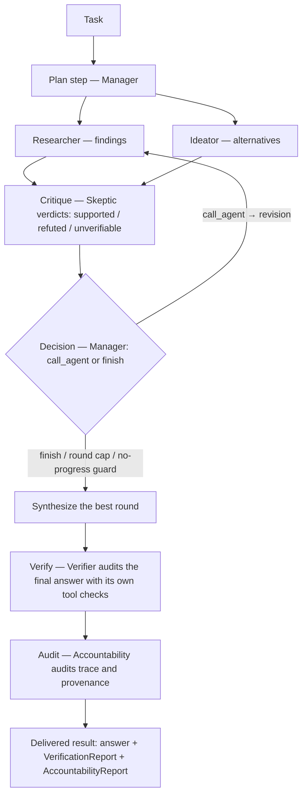
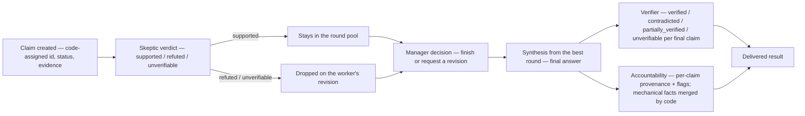

# AI Nexus

**A local-first, evidence-first multi-agent reasoning system.**

AI Nexus answers a task by coordinating six specialized LLM agents — entirely on
your machine, with no cloud inference APIs. Before you get an answer, you get an
**auditable chain of reasoning**: claims with cited evidence, skeptic verdicts on
every claim, routing decisions from a schema-constrained Manager, and two
mandatory audit steps — a Verifier that independently re-checks the final answer
with its own tool calls, and an Accountability agent that audits the run's trace
and provenance. If either audit step fails, the run fails: partial, unaudited
answers are never delivered.

Built with **FastAPI + Ollama (`qwen2.5:14b-instruct`) + React 19/Vite**, SQLite
persistence, and live server-sent-event updates.

> This README — like every `*.md` in this repository — is a **local document**:
> the repo intentionally tracks code only (see
> [Repository conventions](#repository-conventions)). Design history lives in
> `AGENTS.md`, `PLAN.md`, and the `PHASE_*_PRD.md` files.

---

## Contents

- [The problem](#the-problem)
- [Highlights](#highlights)
- [How it works](#how-it-works)
- [Features](#features)
- [Architecture](#architecture)
- [Tech stack](#tech-stack)
- [Getting started](#getting-started)
- [Using AI Nexus](#using-ai-nexus)
- [Testing](#testing)
- [Evaluation & benchmarks](#evaluation--benchmarks)
- [Known limitations](#known-limitations)
- [Future directions](#future-directions)
- [Repository conventions](#repository-conventions)

---

## The problem

Two failure modes make single-shot LLM answers hard to trust:

1. **No structure of belief.** Facts, assumptions, and guesses arrive flattened
   into one fluent paragraph, with provenance that is prose at best.
2. **No independent check.** Nothing re-examines the finished answer with fresh
   eyes — and with fresh *tools* — before it reaches you.

The usual counterweight, multi-agent frameworks, tends to have agents chat with
each other in free-form prose (context leaks, hard to audit) and to assume cloud
APIs.

AI Nexus takes a different bet: agents exchange **structured artifacts only** —
claims, verdicts, decisions, reports — never prose. Everything that matters is
machine-checkable: a claim must carry an epistemic status and citations; a
`supported` verdict without evidence is rejected *by code*; a `verified` status
without independent evidence is rejected *by code*; the process itself is
audited after the fact.

## Highlights

- **Six agents, one orchestrated loop.** Workers never read each other's prose —
  enforced by tests (peer contexts are byte-identical). The only prose that
  crosses a boundary is the final answer, seen by the two auditors.
- **Claim-level epistemology.** Every claim carries a status
  (`fact` / `assumption` / `hypothesis` / `opinion` / `inference` /
  `unverified`), an optional confidence, and cited evidence (`source` +
  optional `quote`).
- **Grammar-constrained structured output.** The model answers through Ollama's
  `format=` JSON-Schema-to-grammar; claim IDs (`c1..cN`) are assigned by code,
  never by the model.
- **Two mandatory audits, fail-closed.** A Verifier re-checks every final claim
  with its own tool calls (four-valued: `verified` / `contradicted` /
  `partially_verified` / `unverifiable`); an Accountability agent audits the
  trace — and mechanical facts are merged in by code so the report can never
  under-report.
- **Deterministic termination.** Stop conditions are guards, not vibes:
  round cap, repeated-decision, no-progress, and step-cap checks produce visible
  synthetic `finish` decisions — no unbounded agent chatter by construction.
- **Fully local.** Inference runs on Ollama; no paid APIs required. Web search
  (DDG→Bing cascade) is optional and off by default.
- **Live, restart-safe UI.** The frontend is a pure reducer over five SSE event
  types; the API replays run events from SQLite after a restart.
- **Serious test discipline.** 564 offline backend tests (≈ 2 s, no model, no
  network), a live integration suite, 109 offline frontend tests, and an eval
  gate with a human-scored, locked rubric.

---

## How it works

### The pipeline

`app/orchestrator.py` is the only loop in the system:



Per round: workers produce claims → the Skeptic verdicts every claim → the
Manager decides (route to a worker for a revision, or finish). When the run
finishes, synthesis picks the **best round** (score = supported − unresolved
claims, later round on ties), then both audits run — both are mandatory on every
completed run.

### The six agents

| Agent | Responsibility | Output | Tools |
|---|---|---|---|
| **Manager** | Plans the first step, then routes the loop. Sees only a bounded registry summary — never worker prose, never memory. | Plan claims + routing decisions | — |
| **Researcher** | Investigates the task; with tools configured, runs a bounded gather loop *before* answering. | Finding claims + evidence | `file_search`, `file_reader`, `memory`, `web_search`¹ |
| **Ideator** | Generates alternatives and options as claims. | Idea claims + evidence | same as Researcher |
| **Skeptic** | Verdicts every claim each round: `supported` / `refuted` / `unverifiable`, with a non-empty objection and its own evidence. | Verdicts | same as Researcher |
| **Verifier** | Audits the **final answer**: one entry per final claim, checked with its own file/web tool calls. A prior `supported` verdict is context, never grounds for `verified`. | `VerificationReport` | `file_search`, `file_reader`, `web_search` |
| **Accountability** | Audits the run itself: trace completeness, per-claim provenance, and flags (10 kinds × `info`/`warning`/`violation`). Never a quality judgment. | `AccountabilityReport` | — |

¹ `web_search` only with `AI_NEXUS_TOOL_WEB_SEARCH_ENABLED=true`; file tools
only when `AI_NEXUS_TOOL_FILES_ROOT` points at a directory; `memory` is always
registered. Manager and Accountability never get tools.

### Claims, verdicts, decisions

The data model (all validated with Pydantic, frozen at use sites, blank strings
rejected at every field):

- **Claim** — `id` (code-assigned), `statement`, `status` (six values above),
  `confidence` (0–1, optional), `evidence[]` (`source` mandatory, `quote`
  optional).
- **Verdict** — targets exactly one claim; `supported` requires evidence or
  `validate_verdicts` rejects the batch.
- **Decision** — `call_agent` (target: Researcher or Ideator, plus an
  instruction) or `finish`, with a reason and confidence. The schema itself
  rejects incoherent decisions; the orchestrator executes them — the Manager
  never does.
- **Revision rule** — keep that worker's supported claims, drop its unresolved
  ones (and their verdicts), append deduplicated new claims.
- **Message kinds** — `plan`, `finding`, `idea`, `critique`, `question`,
  `synthesis`, `decision`, `revision`, `verification`, `accountability`.

### Claim lifecycle



### Design decisions worth knowing

1. **No prose crossing between agents.** Worker prose and per-agent memory are
   invisible to peers — enforced in tests (contexts are byte-identical; the
   Skeptic's input contains zero peer prose; memory is namespaced per
   `(run, agent)`). The two deliberate exceptions: the Verifier and
   Accountability receive the *final answer*, because auditing exactly that is
   their job.
2. **Grammar, not hope, for structure.** Outputs go through Ollama's `format=`
   grammar with a parse-retry-once, and the single retry carries a targeted fix
   hint for known violations (a temperature-0 model otherwise re-emits the
   identical error). `minLength: 1` on schema strings is load-bearing —
   qwen2.5 intermittently emits `""` otherwise.
3. **Tools and grammar cannot share a request** (live-verified), so tool runs
   use two-phase generation: Phase A unconstrained gathering (≤
   `AI_NEXUS_TOOL_MAX_STEPS` executions, with repeat/step/budget guards), then
   Phase B the grammar-constrained answer.
4. **The Manager is a router, not a talker.** Its decisions are JSON executed by
   Python; it sees only the bounded registry summary. No agent can "decide" by
   prose alone.
5. **Fail-closed audits.** `verified` without independent evidence is rejected
   in code; accountability's mechanical facts are computed by
   `enforce_accountability` before persistence, so the model cannot under-report
   the trace it just produced. Any audit-step failure fails the run.
6. **Tools never raise.** `Tool.call` returns JSON envelopes — failures are
   data fed to the model, not exceptions. Tool results are always valid JSON
   (overflow degrades to a preview envelope). File tools confine to
   `AI_NEXUS_TOOL_FILES_ROOT`.
7. **A paced web-search cascade.** Optional DDG→Bing with browser-faithful
   requests, minimum 3 s between calls, jittered retries, UA rotation, and a
   process-local TTL cache; the success envelope reports `provider`/`attempts`/
   `cached`, and a walled call ends as `provider_blocked` (expected, labeled —
   the run still finishes).
8. **Event-projection persistence.** Every mutation rides one `append_event`
   funnel into SQLite (WAL). Reads fall back to disk on a memory miss, so
   `GET /api/runs/{id}` and SSE replay work after a restart; crash recovery
   marks interrupted runs `failed` + `ServerRestart`.
9. **A pure-reducer frontend.** The UI folds SSE events
   (`run_started` → `step_started` / `step_completed` → `run_completed` /
   `run_failed`) into a view model; it never sequences work. Boundaries are
   test-enforced (fetch only in `api.ts`, EventSource only in `sse.ts`) and the
   hand-written wire types are guarded by a backend contract test.

---

## Features

- **End-to-end run orchestration** with iterative critique/revision rounds and
  best-round synthesis.
- **Live web UI**: task form, step feed, per-round panels joining
  claims/verdicts/decisions, verification and accountability panels, final
  answer with claim-status discipline, run history.
- **Evidence visibility**: round panels render claim-level citations and
  verdicts; `selected_round` is computed server-side and delivered with the run.
- **Tool use** for configured agents: sandboxed file search/reader, namespaced
  memory, optional paced web search.
- **Persistence & recovery**: every run stored in SQLite; SSE replay from disk
  after restart; retention cap (500 runs).
- **Health endpoint** reporting model/provider reachability and effective config
  (`GET /api/health`).
- **Graceful shutdown**: `scripts/serve.py` closes SSE streams, marks the live
  run `ServerShutdown`, and exits within a bounded grace period.
- **CLI + eval harness**: full pipeline from the terminal, controlled eval
  problems with mandatory/advisory checks, model benchmark tooling.

---

## Architecture

### Components

| Path | Responsibility |
|---|---|
| `backend/app/llm/` | Ollama provider adapter (chat, grammar, token accounting) — the only place LLM HTTP lives |
| `backend/app/agents/` | Six role modules (prompts + configs), `Agent` one-shot/gather loop, structured output + fix hints, tool-loop phases |
| `backend/app/orchestrator.py` | The loop: plan → research ∥ ideate → critique → decide → (revise)* → synthesize → verify → audit; stop guards; best-round selection |
| `backend/app/claims.py` | Claim/verdict validation (e.g. `supported` requires evidence) |
| `backend/app/audits.py` | Verification rules, audit facts, accountability enforcement (mechanical facts merged by code) |
| `backend/app/runs.py` | Run state machine, step/round records, event types, SSE plumbing |
| `backend/app/db.py` | `RunStore`: SQLite (stdlib, WAL), event projection, replay |
| `backend/app/api/` | FastAPI routers: runs + health |
| `backend/app/tools/` | Tool registry + `file_search` / `file_reader` / `memory` / `web_search` (search cascade in `app/tools/search/`) |
| `backend/app/config.py` | All backend settings (`AI_NEXUS_*` env vars) |
| `backend/app/eval.py`, `backend/scripts/` | Eval-gate machinery and runnable entry points |
| `frontend/src/` | `reducer.ts` (event fold), `evidence.ts` / `audits.ts` (pure derivations), `api.ts` / `sse.ts` (network boundaries), `components/` (14 UI components) |
| `backend/tests/`, `frontend/src/test/` | Offline suites, fakes/fixtures, architecture & wire-contract tests |

### Project structure

```text
ai-nexus/
├── backend/
│   ├── app/
│   │   ├── agents/          # manager, researcher, ideator, skeptic, verifier, accountability
│   │   ├── api/             # runs, health routers
│   │   ├── llm/             # Ollama provider
│   │   ├── tools/           # registry + file/memory/web tools (search/ = cascade)
│   │   ├── orchestrator.py  # the only loop
│   │   ├── claims.py        # claim/verdict validation
│   │   ├── audits.py        # verification + accountability enforcement
│   │   ├── runs.py          # run state machine, events, SSE
│   │   ├── db.py            # RunStore (SQLite, WAL)
│   │   └── config.py        # AI_NEXUS_* settings
│   ├── scripts/             # serve, eval, run_pipeline, smoke, demos, benchmark…
│   ├── tests/               # 564 offline tests + live integration suite
│   └── data/                # SQLite files (created by real runs)
├── frontend/
│   └── src/                 # App, reducer, evidence/audits derivations, components
└── (local docs)             # AGENTS.md, PLAN.md, PHASE_*_PRD.md — not tracked
```

---

## Tech stack

| Layer | Choice |
|---|---|
| Backend | Python ≥ 3.12, FastAPI 0.142, uvicorn 0.54, Pydantic 2.13, pydantic-settings |
| LLM | Ollama locally — `qwen2.5:14b-instruct` (fallback `qwen2.5:7b-instruct`), `num_ctx` 8192, temperature 0 by default |
| Structured output | Ollama `format=` grammar (JSON Schema → grammar) + parse-retry-once |
| Storage | SQLite via stdlib `sqlite3` (WAL, event projection) — no ORM |
| HTTP | `httpx`, confined to `app/llm/` and the search providers by layer rule |
| Frontend | React 19, TypeScript, Vite 8, Vitest 5, Testing Library |
| Transport | REST + SSE (5 event types), wire types guarded by `test_ui_contract.py` |
| Search | DDG→Bing cascade (opt-in), paced + cached |
| Cloud services | **None required** — no cloud inference, no external DB, no paid API |

---

## Getting started

### Prerequisites

- **Python ≥ 3.12**
- **Ollama** on `localhost:11434` with the model pulled
  (`ollama pull qwen2.5:14b-instruct`, ≈ 9 GB) — only needed for live runs;
  offline tests never touch it
- **Node ≥ 20.19**

### Install

```bash
# backend
cd backend
python3 -m venv .venv
.venv/bin/pip install -r requirements.txt -r requirements-dev.txt

# frontend
cd ../frontend
npm install
```

### Run

```bash
# API on :8000 — use this runner, not plain uvicorn (see Known limitations)
cd backend
.venv/bin/python scripts/serve.py

# UI on :5173 (second terminal)
cd frontend
npm run dev
```

Open <http://localhost:5173>, enter a task, press **Run**. A full run is minutes
of local 14B generation — the live feed shows each step as it happens.

Optional: enable the `web_search` tool (off by default):

```bash
AI_NEXUS_TOOL_WEB_SEARCH_ENABLED=true .venv/bin/python scripts/serve.py
```

Every setting is documented in `backend/.env.example` (copy to `.env` to
override); the frontend API base is `frontend/.env.example`
(`VITE_API_BASE_URL`, default `http://127.0.0.1:8000`).

---

## Using AI Nexus

### Web UI

Submit a task and watch the run live: each step (`plan`, `research`, `ideate`,
`critique`, `decide`, `revise`, `synthesize`, `verify`, `audit`) appears in the
feed; round panels join claims, verdicts, and decisions by run-level claim ID;
the verification and accountability panels show both audit reports; the final
result arrives only when both audits pass. Run history is served from SQLite,
including after a backend restart.

### CLI

```bash
cd backend
.venv/bin/python scripts/run_pipeline.py "task" --verbose   # full N-step run
.venv/bin/python scripts/agents_demo.py "task"              # agents alone, no orchestration
.venv/bin/python scripts/smoke.py "prompt"                  # single LLM round-trip
```

| Script | Purpose |
|---|---|
| `scripts/serve.py` | Recommended API runner (bounded graceful shutdown) |
| `scripts/eval.py` | Eval gate: 3 controlled problems → `eval_results.json` |
| `scripts/run_pipeline.py` | One full run from the CLI (`--verbose`, `--json`) |
| `scripts/smoke.py` | Single LLM round-trip |
| `scripts/agents_demo.py` | The agents independently, no orchestration |
| `scripts/tool_refutation_demo.py` | Skeptic refutes a planted claim via tool evidence |
| `scripts/web_search_probe.py` | Web-search hit-rate probe |
| `scripts/benchmark.py` | Model speed/validity benchmark, recommends `primary_model` |

### HTTP API

| Method & path | Purpose |
|---|---|
| `POST /api/runs` | Start a run — `202`; `409` while another run is active (one at a time) |
| `GET /api/runs` | List runs |
| `GET /api/runs/{id}` | Full run: rounds, claims, verdicts, decisions, both reports |
| `GET /api/runs/{id}/events` | SSE stream (replays stored events on reconnect/restart) |
| `GET /api/health` | Provider/model reachability + effective config |

---

## Testing

```bash
# backend — offline suite (no model, no network): 564 passed, ~2 s
cd backend && .venv/bin/python -m pytest -q

# backend — live integration suite (tens of minutes; auto-skips if Ollama is down)
.venv/bin/python -m pytest -q -m integration

# frontend — offline (109 tests, fixtures + fake EventSource)
cd ../frontend && npm test && npm run typecheck
```

Notes that save hours:

- `pytest.ini` defaults to `-m "not integration"` — plain `pytest` is offline
  only; CLI `-m` overrides it.
- Live tests assert *structure* (rounds, kinds, verdict coverage), never
  content — if one fails, re-run once; twice on the same assertion is a real bug.
- The frontend suite needs no backend; wire-format drift is caught on the
  backend side by `test_ui_contract.py` (extend its key sets when payloads grow).
- No CI: run both suites before committing.

---

## Evaluation & benchmarks

### Eval gate (`scripts/eval.py`)

Three controlled problems — `p1` planted falsehood (file corpus), `p2`
underspecified / evidence gap, `p3` simple / well-specified — each with
**mandatory** checks (exit `0` requires all of them) and **advisory** checks
(honest misses on unverifiable answers are expected):

```bash
cd backend
AI_NEXUS_REQUEST_TIMEOUT_S=900 AI_NEXUS_REPEAT_PENALTY=1.2 .venv/bin/python scripts/eval.py
.venv/bin/python scripts/eval.py --rescore eval_results.json   # re-score persisted runs, no model calls
```

Results of the green run of record (2026-10-03, preserved in
`backend/eval_results.json`):

| Metric | Result |
|---|---|
| Mandatory checks | **24 / 24** |
| Advisory checks | 7 / 17 |
| Verdict mix | 12 supported · 2 refuted · 19 unverifiable (refutation rate 6.1 %) |
| Rounds | p1: 3 · p2: 1 · p3: 2 |
| Cost | 93,178 tokens · ~82 min wall |

The `human_scores` rubric (correctness / evidence use / honesty, 1–5, with
rationales) is **human-judged and locked** — never auto-filled or LLM-generated:

| Problem | Correctness | Evidence use | Honesty |
|---|---|---|---|
| p1 planted falsehood | 4 | 4 | 5 |
| p2 underspecified / evidence gap | 3 | 3 | 4 |
| p3 simple / well-specified | 2 | 3 | 3 |

The baseline of record is `backend/eval_baseline_2026-10-03.json`; it is the
number Phase 12's debate-mode proposal must beat (gate sentence in
`PHASE_11B_PRD.md`, Appendix A).

### 34-run benchmark (2026-10-04)

A three-stage evaluation of the system as it actually behaves — **no run was
ever re-run to obtain a nicer result**; failures are recorded as-is:

| Stage | Runs | What it measured | Outcome |
|---|---|---|---|
| A — head-to-head | 14 (7 tasks × {single-agent baseline, Nexus}, same model & tools) | answer quality + cost | 13 completed / 1 failed |
| B — general tasks | 15 (G1–G15, no external evidence available) | claim/verdict/audit behavior under stress | 13 completed / 2 failed |
| C — web research | 5 (R1–R5, `web_search` on) | evidence gathering from the live web | 0 completed / 5 failed |

**Totals: 26 / 34 runs completed · 971,653 tokens · 15.2 h wall.**

**Stage A — per-task verdicts (7 paired tasks):**

| Task | Verdict | Why |
|---|---|---|
| B1 planted falsehood | Nexus better (marginal) | Both rejected the false figure; only Nexus engaged the "unaudited" caveat — but Nexus's claim layer carried a provenance defect |
| B2 conflicting documents | Equivalent | Both fully correct; baseline in 139 s / 2.8k tokens vs Nexus 2 773 s / 58k |
| B3 underspecified forecast | **Nexus better** | Baseline returned a meta-answer; Nexus delivered a substantive, honest answer with explicit refutation of unsourced numbers |
| B4 system design tradeoff | **Nexus better** | Baseline again produced a non-answer; Nexus produced a real recommendation with tradeoffs |
| B5 technical debugging | Equivalent | Both met every expected criterion; baseline richer per token |
| B6 quantitative reasoning | **Baseline better** | Same final figure, but Nexus's intermediate arithmetic in the answer was wrong and it hedged the task's own givens |
| B7 web research | **Baseline better** | Nexus run **failed** (verifier structured-output error → whole run failed, no answer); baseline completed with verified URLs |

**Tally: Nexus better 3 · baseline better 2 · equivalent 2.**
**Cost: baseline 801 s / 12,371 tokens vs Nexus 14,662 s / 286,575 tokens
(~18× wall-clock, ~23× tokens).**

Stated honestly, the evidence says: the architecture measurably helped on the
tasks where the single agent produced a non-answer (B3, B4) and added one real
nuance (B1); it was equivalent on two, actively hurt one (process noise corrupted
trivial arithmetic), and was undercut by a reliability defect on one. On 7 tasks
/ 1 model this is **insufficient to establish overall superiority** — the value
is real but conditional, and the audit-step reliability defect currently
undermines it.

**Stage B (G1–G15):** 13/15 completed (two verifier structured-output kills).
With all external evidence disabled, three runs (G4, G9, G15) fabricated source
provenance with zero tool calls — a P1 finding that no audit step checks for.
Completed runs cost ≈ 383k tokens / 6.2 h.

**Stage C (R1–R5):** 0/5 delivered a final answer — four runs died at the
critique step and one at verify (mid-JSON truncation at the structured-output
token cap). Where search evidence was captured it was real: **8/8 spot-checked
URLs resolve HTTP 200** — the opposite of Stage B's fabricated provenance. The
first `web_search` call failed with `internal_error` in 5/5 runs.

Full reports and raw artifacts (per-run traces, manifest, findings file) live
alongside this README: `benchmark_comparison_report.md`, `15_test_runs.md`,
`5_research_runs.md`.

---

## Known limitations

**Runtime behavior**

- **Latency**: a run is 5–25 minutes of local 14B generation; iterative,
  tool-heavy runs sit at the upper end. This is the product, not a bug.
- **One active run at a time** (`409` on a second `POST /api/runs`); single
  SQLite writer per file — never run two writers on one DB.
- **`web_search` blocks are real**: free providers occasionally return bot
  challenges; runs finish gracefully with labeled prior-knowledge claims
  (`provider_blocked` is expected, not a crash). Check hit rates with
  `scripts/web_search_probe.py`.
- **Model loops**: Ollama can abort long generations with
  `500 token repeat limit reached`. The run fails visibly with a tuning hint —
  re-run or raise `AI_NEXUS_REPEAT_PENALTY`. No code path auto-retries.
- **Graceful shutdown**: plain `uvicorn app.main:app` can linger on an open SSE
  connection; prefer `scripts/serve.py`, which passes `timeout_graceful_shutdown`
  and drains streams before exit.

**Findings from the 34-run evaluation (unfixed)**

- **Structured-output validation can kill a run that already has its answer**
  (8/34 eval runs, 5 distinct modes) — by design any audit-step failure fails
  the run, with no partial delivery. Two verified mechanics: a fix-hint mismatch
  (the retry is told to fill a field the validator never reads, so the retry
  cannot pass), and a 2048-token structured-output cap that truncated a long
  verifier report mid-JSON.
- **`web_search` fails on the first call of every web-enabled run**
  (`internal_error` within ~30 ms; later calls succeed) — transport failures are
  not retried inside the call.
- **No evidence-grounding check exists**: claims can cite sources no tool ever
  returned (fabricated provenance observed in G4/G9/G15 and a phantom
  "web search was conducted" claim in an eval run). Until such a check exists,
  treat claim-level `evidence[].source` as model-generated text, not fact.
- **Cost is the standing tax**: ~18× wall-clock and ~23× tokens versus a single
  agent on the same tasks — whether the observed 3-of-7 improvement justifies it
  depends on the task class.
- **Evidence scope**: 1 model (qwen2.5:14b), 34 runs, no repeated trials per
  configuration — conclusions are indicative, not definitive.

---

## Future directions

- **Phase 12 — debate mode**: a proposal exists in `DEBATE_MODE_PROPOSAL.md`
  (proposed, not approved). Its evaluation gate is the locked Phase 11b rubric
  baseline above.
- **Fix the evaluation-found defects**: structured-output validation robustness
  (validator/hint alignment, per-role token budgets), in-call retry for search
  transport failures, and an evidence-grounding check hooked into the
  accountability pass — then re-run the 34-run benchmark.
- **Scale the evidence**: more tasks, repeated trials, and a second model before
  any stronger claim about multi-agent vs. single-agent performance.

---

## Repository conventions

- **Code only in git.** Every `*.md` (this README, `AGENTS.md`, `PLAN.md`,
  PRDs) is intentionally untracked — back them up separately; don't un-ignore
  without asking.
- **No CI.** Before committing, run both suites:
  `pytest -q` in `backend/`, `npm test` + `npm run typecheck` in `frontend/`.
- **Commit style**: `Phase N: <summary>` with a bullet body.
- Never commit `.venv`, `benchmark_results.json`, `__pycache__`, or `.env`.
